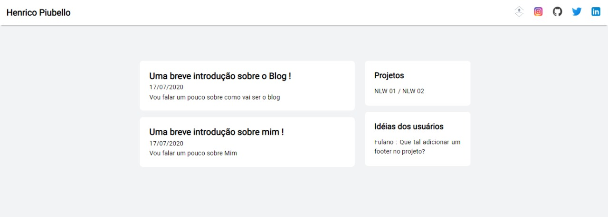

# Blog criado com Gatsby e Reactjs <3

## Projeto desenvolvido com acompanhamento do tutorial do João pedro

>Link => [João pedro](https://www.joaopedro.cc/blog-com-gatsby-e-react-parte-1)

Incrível o que o Gatsby consegue fazer juntamente com o React e Graphql
